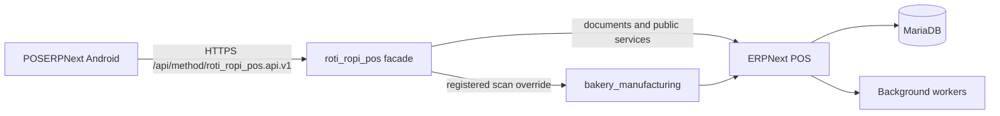

# Mobile POS Architecture

## Evidence Legend

- **Verified**: Confirmed in the installed source or current repository state.
- **Approved**: A Phase 0 architecture decision approved for implementation.
- **Proposed**: The target design for `roti_ropi_pos`; it is not implemented yet.
- **Inferred**: A conclusion drawn from verified behavior and called out for validation.

## Context

- **Verified**: The bench contains Frappe `16.27.1`, ERPNext `16.28.0`, `bakery_manufacturing` `0.0.1`, and `roti_ropi_pos` `0.0.1`.
- **Verified**: `roti_ropi_pos` is an installed but otherwise minimal Frappe app. It has no Mobile POS API or custom DocType yet.
- **Verified**: `POSERPNext` is a separate Android project containing only a generated Jetpack Compose starter UI. It has no networking, persistence, or POS workflow implementation.
- **Verified**: No approved Android implementation plan currently exists at `/Users/rotiropi/DockerERPNext/POSERPNext/docs/mobile-pos/implementation-plan.md`.
- **Approved**: The generated Compose starter is not the approved application architecture. Android implementation uses Kotlin, XML Views, ViewBinding, and minSdk 23; Jetpack Compose requires separate explicit approval.
- **Approved**: Android implementation remains blocked until a separate plan at that path is written and explicitly approved.
- **Verified**: ERPNext owns the accounting, stock, POS Profile, POS Opening Entry, POS Invoice, POS Closing Entry, pricing, tax, payment, serial, and batch records.
- **Verified**: `bakery_manufacturing` owns bakery-specific behavior, including Price Group synchronization and the batch barcode UOM enrichment.

## Goals

- **Proposed**: Provide a stable, versioned, mobile-oriented API without exposing ERPNext's broad internal methods directly to Android.
- **Proposed**: Preserve ERPNext as the transactional source of truth and let its controllers perform pricing, tax, stock, payment, serial, batch, submission, and consolidation validation.
- **Proposed**: Make every business mutation safely retryable after mobile timeouts or connection loss.
- **Proposed**: Enforce POS Profile assignment, cashier identity, opening-session ownership, and operation permissions at the facade boundary.
- **Proposed**: Keep Android independent of Frappe document shapes and internal function names.
- **Approved**: Authenticate each cashier through OAuth 2.0 Authorization Code with mandatory PKCE S256 as a public Android client, with no embedded client secret.
- **Approved**: Search and select existing registered Customers, default omitted customer selection to the POS Profile walk-in Customer, and never auto-create a Customer from a POS transaction.

## Non-Goals

- **Proposed**: Do not duplicate ERPNext ledgers, stock calculations, pricing rules, tax calculations, or POS consolidation logic.
- **Proposed**: Do not create an offline accounting engine. The Android client may retain a pending request for retry, but ERPNext remains authoritative.
- **Proposed**: Do not import private functions from `bakery_manufacturing`; integrate through its registered ERPNext override or an explicitly public function if one is added later.
- **Proposed**: Do not modify files under `apps/erpnext` or `apps/frappe`.
- **Proposed**: Do not include the approved Price Group sidebar migration in Mobile POS implementation work.
- **Approved**: V1 has no health endpoint. Adding one requires an explicitly approved backend contract and task.
- **Approved**: V1 has no return-preview endpoint. Cashier correction uses the existing `sales.create_return` contract; adding preview requires an explicitly approved backend contract and task.
- **Approved**: The MVP has no maximum shift-duration policy. A manager policy may be designed later, but it requires separate approval and must not be inferred from a calendar-day boundary.

## System Boundaries

- **Proposed**: Android knows only the v1 contracts documented in `api-contract.md`.
- **Proposed**: `roti_ropi_pos` authenticates the Frappe user, authorizes the operation, validates the request, handles idempotency, and maps stable API objects to ERPNext documents.
- **Approved**: Dedicated mobile users receive only the minimal `Mobile POS Cashier` application role. A Frappe `auth_hook` rejects legacy `cmd`, restricts exact routes, enforces PKCE S256 on authorize/approve, and verifies every v1 Bearer token belongs to the configured Mobile POS OAuth Client and an enabled cashier.
- **Verified**: ERPNext POS Closing Entry submission may enqueue consolidation when at least ten invoices are involved. A successful close request therefore does not always mean consolidation has completed.
- **Proposed**: `bakery_manufacturing` remains the owner of Price Group and batch-UOM policy; `roti_ropi_pos` consumes resulting POS Profile price lists and the effective `scan_barcode` override.

## Backend Components

| Component | Responsibility | Status |
| --- | --- | --- |
| `roti_ropi_pos.api.v1` | Whitelisted HTTP endpoints and request parsing | **Proposed** |
| `roti_ropi_pos.mobile_pos.authorization` | Current-user, role, profile, and session checks | **Proposed** |
| `roti_ropi_pos.mobile_pos.responses` | Stable success/error envelopes and request IDs | **Proposed** |
| `roti_ropi_pos.mobile_pos.idempotency` | Durable mutation deduplication and replay | **Proposed** |
| `roti_ropi_pos.mobile_pos.catalog` | Safe catalog, item detail, stock, and scan mapping | **Proposed** |
| `roti_ropi_pos.mobile_pos.customers` | Registered-customer search and walk-in/default resolution | **Proposed** |
| `roti_ropi_pos.mobile_pos.invoices` | POS Invoice and return orchestration | **Proposed** |
| `roti_ropi_pos.mobile_pos.closing` | Closing preview, submit, and asynchronous status | **Proposed** |
| ERPNext controllers | Business validation and all ledger effects | **Verified** |

## Principal Flows

### Bootstrap

1. **Approved**: Android authenticates in the system browser through Authorization Code with PKCE S256, then calls `bootstrap.get` with the bearer token.
2. **Proposed**: The facade derives the user from `frappe.session.user`; it never accepts a cashier identity from the request.
3. **Approved**: The facade returns only enabled POS Profiles explicitly assigned to the authenticated cashier.
4. **Proposed**: The response includes the current opening session, its posting date and opening timestamp, default walk-in Customer, available actions, server time, and API version.
5. **Approved**: A prior-day opening remains current while it is submitted, Open, unclosed, owned by the authenticated cashier, and within the selected profile/company scope.
6. **Approved**: The opening DTO exposes stable `STALE_OPENING` warning data when its opening timestamp is on an earlier site-calendar date.

### Open Session

1. **Proposed**: Android supplies a POS Profile, opening balances, and an idempotency key.
2. **Approved**: The facade verifies profile eligibility and the exact POS Opening Entry create/submit permissions granted to `Mobile POS Cashier`; it does not require Sales Manager.
3. **Verified**: ERPNext validates enabled profile/company, enabled user, conflicting open entries, and payment-mode accounts.
4. **Proposed**: The submitted ERPNext document name is returned and stored with the idempotency record.

### Catalog and Scan

1. **Proposed**: Catalog results are scoped to an authorized POS Profile and expose display data only.
2. **Proposed**: Scan resolves `erpnext.stock.utils.scan_barcode` through `frappe.override_whitelisted_method()` before calling it, so the registered `bakery_manufacturing` override enriches batch scans with the configured UOM.
3. **Verified**: A barcode result identifies an item, serial, or batch but does not establish sufficient saleable stock.
4. **Proposed**: Before sale submission, the facade rebuilds item details, prices, conversion factors, taxes, warehouse, and stock-sensitive fields server-side.

### Customer Selection

1. **Approved**: Customer is a global ERPNext master and has no ordinary Company ownership field. Frappe `owner` identifies the creating user, while `represents_company` applies only to internal Customers.
2. **Approved**: The authorized POS Profile fixes the transaction Company; it does not create a synthetic Customer-to-Company ownership relation.
3. **Approved**: A Customer is eligible when it is enabled, visible through normal Customer read permissions, and satisfies:
   `profile.customer_groups is empty OR customer.customer_group is in the configured groups' closure`.
4. **Approved**: A configured Customer Group closure contains each configured group and all of its descendants.
5. **Approved**: `customers.search` applies the same predicate through a bounded, permission-aware query.
6. **Approved**: The explicit `POS Profile.customer` must pass the same existence, enabled, read-permission, and Customer Group predicate checks as any explicitly selected Customer. An invalid configured default produces `PROFILE_CONFIGURATION_INVALID`.
7. **Approved**: Quote passes profile Company and Customer context to ERPNext but remains non-authoritative. Sale or return submission is the authoritative enforcement point for account, Company, and internal-party compatibility.
8. **Approved**: Omitting `customer` resolves to the authorized POS Profile's default walk-in Customer.
9. **Approved**: `walk_in_customer_name` is accepted only for that default walk-in Customer and is stored through the existing bakery custom field boundary.
10. **Approved**: Search, quote, sale, and return endpoints never create a Customer record.

### Submit Sale

1. **Proposed**: Android sends item identities, quantities, selected UOM/batch/serial values, payment intent, and an idempotency key. Client totals and accounts are not authoritative.
2. **Proposed**: The facade verifies the current user's open session and profile, creates a POS Invoice, invokes core missing-value calculation, and submits it in one request transaction.
3. **Verified**: ERPNext submission validates POS mode, payments, profile/company consistency, stock, serials, batches, and partial-payment rules.
4. **Approved**: MVP submission rejects any invoice with non-zero outstanding amount. Multiple distinct payment modes are allowed only when the final invoice is fully settled.
5. **Proposed**: The response contains the ERPNext document name, authoritative totals, payment summary, and posting status.

### Return and Correction

- **Proposed**: Returns use ERPNext's mapped return document and submit a negative POS Invoice after core quantity/payment validation.
- **Approved**: Mobile cancellation is outside the cashier MVP. Completed sales are corrected with returns; manager cancellation remains an ERPNext Desk operation until a separate manager policy is approved.

### Close Session

1. **Proposed**: The facade derives cashier, profile, opening entry, and invoice time range server-side.
2. **Proposed**: A preview returns expected payment totals but performs no mutation.
3. **Approved**: `Mobile POS Cashier` receives only the exact POS Closing Entry create/write/submit permissions needed for its own assigned profile and opening; no Sales Manager role is granted.
4. **Proposed**: Submit creates and submits POS Closing Entry; it never invokes merge-log helpers directly.
5. **Proposed**: Android polls closing status until `submitted` or `failed` when consolidation is asynchronous.

## Data and Transaction Rules

- **Proposed**: Every standard HTTP mutation is one database transaction; closing uses the recovery exception below.
- **Proposed**: Standard API code must not call `frappe.db.commit()`; request-level commit/rollback remains authoritative.
- **Verified**: ERPNext closing consolidation commits internally and can enqueue before the outer request commits.
- **Proposed**: Closing is the documented exception: its recovery protocol durably commits the request and Draft Closing Entry before submit, and a POS Closing Entry controller override defers the queued branch until the submitted document commits. Recovery then reconciles the referenced core document after interruption. See `idempotency-and-recovery.md`.
- **Proposed**: Client-provided rates, taxes, accounts, totals, owner, user, company, warehouse, and posting status are treated as untrusted hints or rejected.
- **Proposed**: API serialization uses ISO 8601 timestamps with timezone offsets and decimal amounts as strings.
- **Proposed**: Internal exceptions and stack traces are logged with a request ID but never returned to Android.
- **Approved**: Durable idempotency records are retained for 90 days after they become terminal and cleanup-eligible. Processing, unresolved recovery, and audit-held records are never deleted by age alone.

## Deployment Shape

- **Proposed**: `roti_ropi_pos` deploys as a normal private-bench Frappe app on the same bench as ERPNext and `bakery_manufacturing`.
- **Proposed**: No separate database or API gateway is introduced for v1. The Frappe auth hook is the mobile route gate, and ERPNext's existing workers remain responsible for queued closing consolidation.
- **Inferred**: Same-process integration is the least risky initial architecture because ERPNext document submission must remain transactional.

## Approved Phase 0 Decisions

- **Approved**: Android authentication is OAuth 2.0 Authorization Code with mandatory PKCE S256, individual cashier identity, and no embedded secret.
- **Approved**: `Mobile POS Cashier` replaces broad Accounts/Sales Manager role requirements for the app lifecycle through explicit Custom DocPerm and endpoint checks.
- **Approved**: MVP invoices must be fully settled; partial payment is post-MVP.
- **Approved**: Registered-customer search, POS Profile default walk-in Customer, and optional bakery walk-in display name are supported without Customer auto-creation.
- **Approved**: MVP supports POS Invoice mode only and returns `UNSUPPORTED_POS_MODE` for any other configuration.
- **Approved**: Idempotency records have a 90-day terminal retention policy with recovery and audit holds.
- **Approved**: Mobile sale cancellation is outside the cashier MVP and does not block Backend Phase 1.

## Source Evidence

- **Verified**: `erpnext/selling/page/point_of_sale/point_of_sale.py:134-347,499-510`
- **Verified**: `erpnext/accounts/doctype/pos_invoice/pos_invoice.py:199-570,659-915`
- **Verified**: `erpnext/accounts/doctype/pos_closing_entry/pos_closing_entry.py:60-443`
- **Verified**: `erpnext/accounts/doctype/pos_invoice_merge_log/pos_invoice_merge_log.py:457-651`
- **Verified**: `frappe/auth.py:28-118,629-739`
- **Verified**: `frappe/handler.py:65-86`
- **Verified**: `frappe/integrations/oauth2.py:93-175,314-341,397-419`
- **Verified**: `frappe/oauth.py:76-92,130-167`
- **Verified**: `frappe/tests/test_oauth20.py:153-196`
